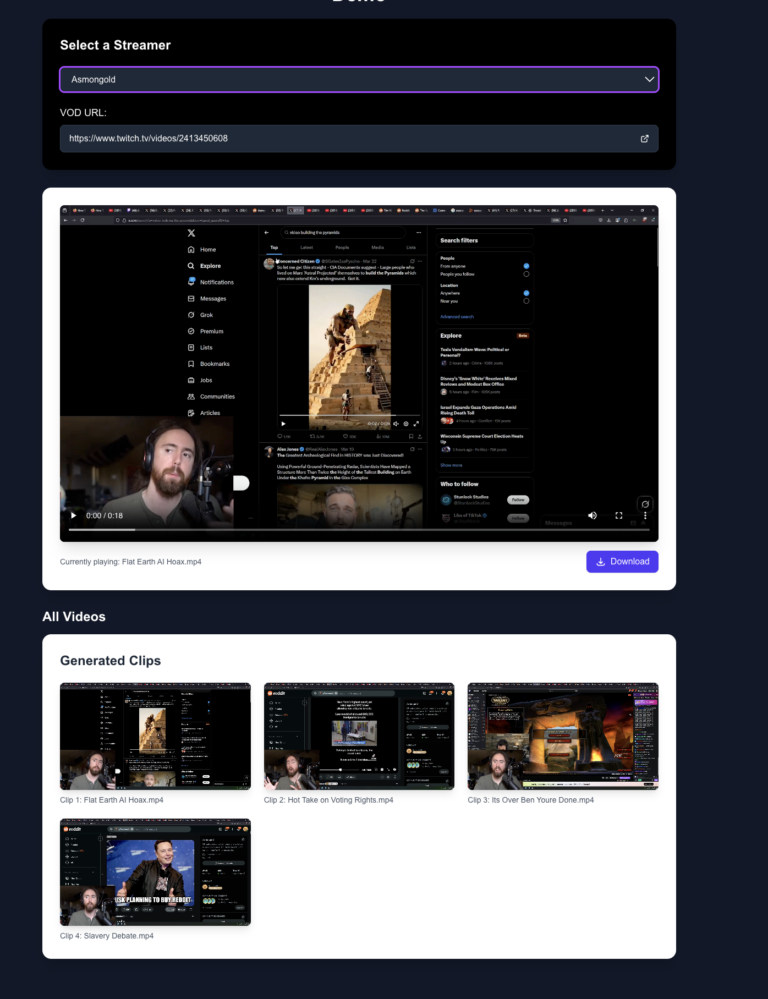

# 🎥 Clipception: Automated Stream Highlight Generator

<p align="center">
  
</p>

Clipception automatically identifies and extracts the most viral and engaging moments from your streams. Perfect for content creators looking to repurpose streaming content with minimal effort.

> **⏰ Processing Time**: For a 1080p VOD that is 4+ hours long, expect approximately 30 minutes processing time.

## 🔗 Links
- **Web App**: [clipception.xyz](https://clipception.xyz)
- **Twitch**: [twitch.tv/krystal_mess323](https://www.twitch.tv/krystal_mess323)
- **YouTube**: [youtube.com/@krystal_mess323](https://www.youtube.com/@krystal_mess323)

## 📺 In Action

<p align="center">
  
</p>

## 🔍 Features

- 🎯 **AI-Powered Clip Detection**: Automatically identifies engaging moments
- 🔊 **Advanced Audio Analysis**: Detects excitement, laughter, and key moments
- 💪 **GPU Acceleration**: Optimized for faster processing with CUDA support
- 📊 **Engagement Metrics**: Ranks clips based on potential virality
- 🎬 **Reliable Extraction**: Uses subprocess for improved stability
- 🔄 **Celery Integration**: Background task processing for web application

## 🚀 Installation

### Prerequisites
- Python 3.10 or later
- CUDA-compatible GPU (recommended for faster processing)
- FFmpeg installed on your system

### Setup

1. **Create a virtual environment**:
   ```bash
   conda create -n clipception python=3.10
   conda activate clipception
   ```

2. **Set API Key**:
   ```bash
   export OPEN_ROUTER_KEY='your_key_here'
   ```

3. **Install Dependencies**:
   
   Option A - Using UV (recommended for speed):
   ```bash
   wget https://astral.sh/uv/install.sh | sh
   uv pip install -r requirements.txt
   ```
   
   Option B - Using pip:
   ```bash
   pip install -r requirements.txt
   ```
   
   Additional dependencies that may need separate installation:
   ```bash
   pip install git+https://github.com/openai/whisper.git
   pip install pydub
   ```

## 💻 Usage

### Command Line
```bash
python process_video_v4.py /path/to/your/video.mp4
```


## 📦 Output Structure

Files are organized in the `FeatureTranscribe/` directory:

- `[video_name].enhanced_transcription.json` - Detailed transcription with audio features
- `top_clips_one.json` - Ranked clips with engagement metrics
- `clips/` - Directory containing extracted video segments ready for upload

## 🛠️ Configuration

You can customize the clip detection parameters by modifying the settings in `config.json`:

- `min_clip_duration`: Minimum clip length in seconds (default: 20)
- `max_clip_duration`: Maximum clip length in seconds (default: 120)
- `excitement_threshold`: Level of excitement required (0-1)
- `laughter_threshold`: Laughter detection sensitivity (0-1)

## 🤝 Contributing

Contributions are welcome! Please feel free to submit a Pull Request.

## 📄 License

This project is licensed under the MIT License - see the LICENSE file for details.

## 🙏 Acknowledgements

- [OpenAI Whisper](https://github.com/openai/whisper) for transcription
- [OpenRouter](https://openrouter.ai/) for AI processing
- All the streamers and homies on twitch who've helped test and improve Clipception
